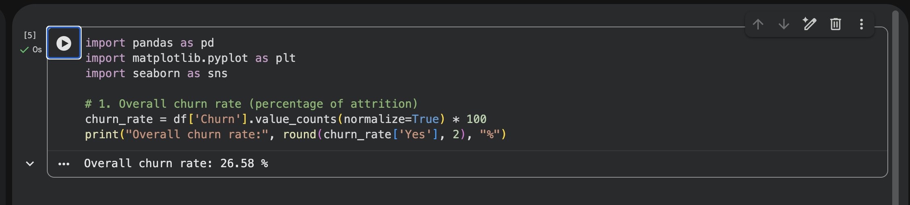
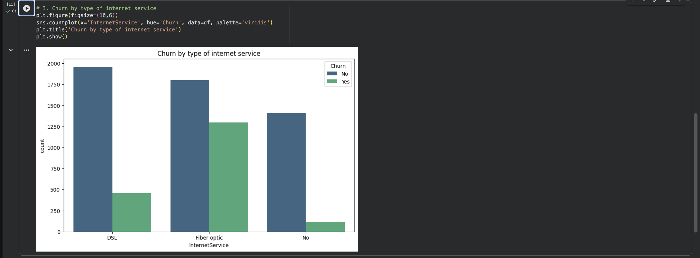

# telco-churn-analysis

# Telco Churn Analysis: how to reduce attrition by 15–20%

Product case study on the Telco Customer Churn dataset (subscription service).

**Key insights:**  
- Churn rate = 26.5%  
- Month-to-month contracts — the main source of outflow  
- Fiber optic Internet — high churn  
- High-paying customers are more likely to leave

**Graphs:**  

### Churn rate

  

### Churn by contract

### Churn by internet

### Charges vs churn

**Analysis code:** telco_churn_analysis.ipynb

**Growth hypotheses:**  
- Bundle of services → -12% churn  
- Discounts after 12 months → +10% retention  
- Personalized offers → +15% LTV

Full version in Notion: [https://tundra-leaf-b86.notion.site/churn-subscription-service-Telco-Churn-2e20c0bce00a8054850bc6d3b13462cc]

#productanalytics #churn #python #pandas #portfolio
